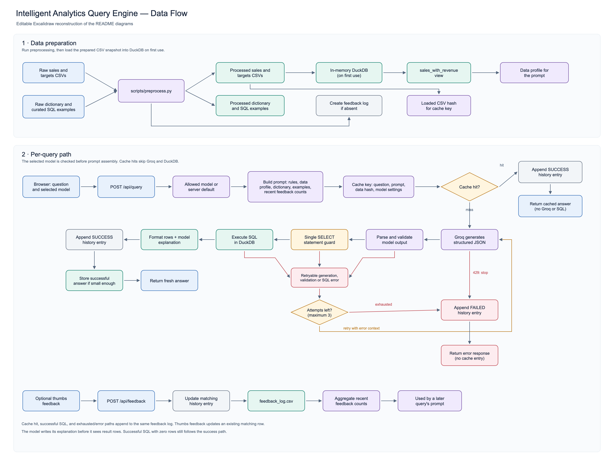
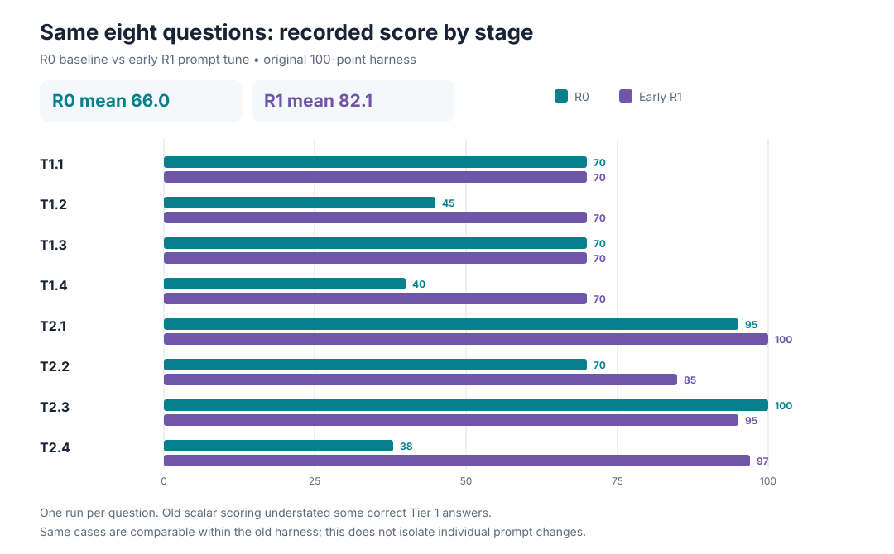
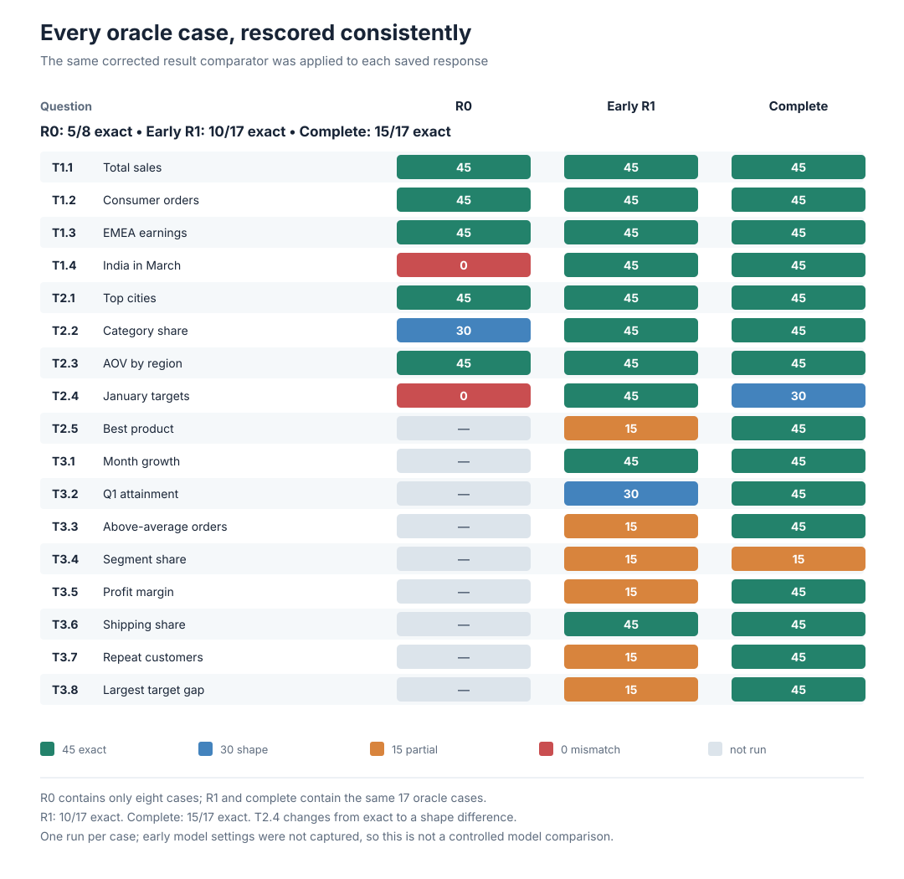
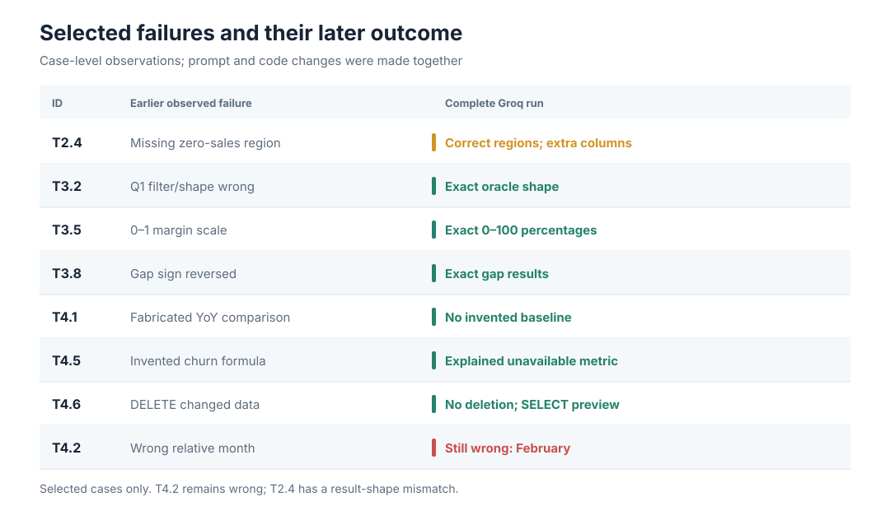
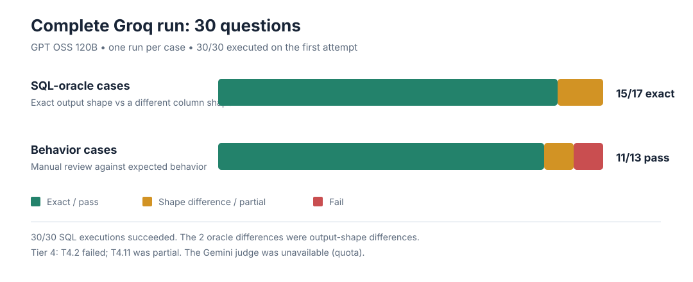

# Intelligent Analytics Query Engine

Ask questions about the included sales data in plain language. Groq generates DuckDB SQL, the app runs it locally, and the browser displays the result, SQL, explanation, and a confidence estimate.

The project includes data preparation, a read-only SQL guard, a bounded response cache, user feedback, regression tests, and model evaluation traces.

## Contents

- [Run locally](#run-locally)
- [How it works](#how-it-works)
- [Models and configuration](#models-and-configuration)
- [Caching](#caching)
- [Tests and evaluation](#tests-and-evaluation)
- [Evaluation results](#evaluation-results)
- [Limits and next improvements](#limits-and-next-improvements)
- [Project layout](#project-layout)

## Run locally

Requirements: Python 3.10+, [`uv`](https://docs.astral.sh/uv/), and a Groq API key with access to one of the supported models.

```bash
uv sync
cp .env.example .env
```

Add your key to `.env`:

```dotenv
GROQ_API_KEY_2=your_groq_api_key
```

Start the app:

```bash
uv run python main.py
```

Open [http://localhost:8000](http://localhost:8000). The app creates missing files in `data/processed/` from the tracked source data on first query. To prepare them manually, run `uv run python scripts/preprocess.py`. Paths are resolved from the repository, so the checkout can live in any directory. Do not commit `.env` or put API keys in source code.

### API routes

| Method | Route | Purpose |
|---|---|---|
| `GET` | `/` | Chat interface |
| `POST` | `/api/query` | Generate and run a read-only query |
| `GET` | `/api/models` | List supported models and default |
| `GET` | `/api/history` | Read recent query history |
| `POST` | `/api/feedback` | Save thumbs feedback for a query |

Example:

```bash
curl -s http://localhost:8000/api/query \
  -H 'Content-Type: application/json' \
  -d '{"query":"Total sales in India for March"}'
```

## How it works



### Data preparation

Raw files are stored in `data/`. `scripts/preprocess.py` cleans spreadsheet export issues and writes generated inputs to the ignored `data/processed/` directory. If these files are missing, the app generates them on first database use. DuckDB loads sales and targets into memory and adds a `sales_with_revenue` view with:

- `revenue = quantity * unit_price * (1 - discount)`
- `order_month`, formatted as `YYYY-MM`

The prompt's data profile is read from DuckDB and lists date coverage and valid category and geography values. A hash of the loaded sales and target files identifies the data snapshot for caching.

### Query path

1. The browser sends a question and selected model to `/api/query`.
2. The engine builds a prompt from the rules, schema, live data profile, curated examples, and aggregate feedback counts.
3. A cache hit returns a previous successful answer without calling Groq or rerunning SQL.
4. On a miss, Groq returns structured JSON containing logic, SQL, explanation, and confidence.
5. DuckDB permits one `SELECT` statement. External file and network access are disabled after data loading.
6. SQL or parsing errors can trigger up to three generation attempts. Rate-limit errors stop retries immediately.
7. Successful answers are returned, logged, and cached if they fit the size limit. Thumbs feedback updates the matching history row and future prompts receive aggregate counts only.

The model writes its explanation before seeing result rows. The [editable Excalidraw diagram](docs/diagrams/application-data-flow.excalidraw) and [clipboard JSON](docs/diagrams/application-data-flow.clipboard.json) contain the same flow.

### Prompt and safeguards

The prompt in `app/prompts.py` provides the schema, metric definitions, dataset values, date coverage, DuckDB syntax guidance, examples, and rules for unavailable or ambiguous requests. It asks for supporting metrics in ranking answers and requires assumptions to be explained.

Prompt instructions alone do not enforce safety. `app/database.py` rejects anything except one `SELECT`, and DuckDB external access is disabled after source files are loaded. Confidence is supplied by the model; it is not a calibrated probability.

## Models and configuration

Users can select these Groq-hosted models in the interface:

- `openai/gpt-oss-120b` (default)
- `openai/gpt-oss-20b`
- `qwen/qwen3.8-27b`

`GROQ_MODEL` changes the server default. The selected model is checked against the supported list. Other settings are in `app/config.py`.

| Setting | Default | Purpose |
|---|---:|---|
| `GROQ_TEMPERATURE` | `0.1` | Generation temperature |
| `GROQ_MAX_TOKENS` | `2048` | Maximum response tokens |
| `MAX_SELF_CORRECT_ATTEMPTS` | `3` | Generation and execution attempts |
| `QUERY_CACHE_MAX_ENTRIES` | `128` | Cache entry limit |
| `QUERY_CACHE_MAX_ENTRY_BYTES` | `262144` | Maximum response size per entry |

## Caching

`app/cache.py` keeps a bounded, process-local LRU cache of successful responses. Its key includes:

1. The question with whitespace collapsed (case and punctuation still matter).
2. The complete prompt, including feedback counts.
3. The loaded sales and target data hash.
4. Model, temperature, and token limit.

For example, `"Total sales"` and `" Total   sales "` can share an entry. A paraphrase uses a different key and calls Groq again; the cache does not infer semantic similarity.

The cache holds up to 128 entries of at most 256 KiB each. It evicts the least recently used entry when full. Failed responses are not cached. A cache hit returns a copy with `attempts=0` and `cache_hit=true`, and is still added to history. Restarting the app clears the cache; each server worker has its own cache. Changing the prompt, data, feedback context, or model settings creates a cache miss.

## Tests and evaluation

### Regression suite

Run deterministic checks with:

```bash
uv run python -m unittest discover -s tests -p 'test_*.py' -v
```

Coverage includes read-only enforcement, multiple statements, external file reads, scalar result comparison, feedback prompt-injection protection, rate-limit retries, and cache behavior.

### Model evaluation

`tests/eval/queries.yaml` contains tiered questions. Some have oracle SQL for exact result comparison; behavior cases cover unsupported metrics, missing periods, prompt injection, and write requests.

Start the app, then run the full harness in another terminal:

```bash
uv run python main.py
uv run python -m tests.eval.run_eval
```

The full harness calls the local API, compares results with DuckDB oracle queries, and uses Gemini to judge explanations and SQL quality. Configure `GEMINI_API_KEY_0` through `GEMINI_API_KEY_3` for the judge. Traces and summaries are saved under `tests/eval/traces/`.

If Gemini quota is unavailable, use the Groq-only runner. It scores oracle cases locally; behavior cases need manual review.

```bash
uv run python -m tests.eval.run_groq_eval
uv run python -m tests.eval.run_groq_eval --ids T1.1 T3.1 T4.2
```

The evaluator normalizes numeric scalar strings and compares row/value pairs. Tier 4 behavior scores are not measured correctness results unless they were judged or reviewed.

## Evaluation results

The prompt, execution guard, and evaluation harness changed over several runs. The complete results and underlying traces are documented in [EVALUATION_TRACE.md](docs/EVALUATION_TRACE.md).

| Stage | Questions | Recorded result |
|---|---:|---|
| R0 baseline | 8 | Mean 66/100; 2 scored at least 80 |
| Early R1 | 27 | Mean 55.8/100; 6 scored at least 80; run stopped after a generated `DELETE` affected later queries |
| Revised prompt and guards | 30 | All executed; 15/17 oracle shapes matched; 11/13 behavior cases passed manual review |

R0 and early R1 used different catalogs. For the same eight cases, recorded mean score rose from 66.0 to 82.1 under the early scoring rules. This is not a controlled estimate of a prompt change: traces lacked full prompt snapshots, and code and evaluator behavior changed too.



*Each question was run once. See the [R0 trace](tests/eval/traces/2026-09-23T09-40_R0/results.jsonl) and [early R1 trace](tests/eval/traces/2026-09-23T09-47_R1/results.jsonl).*

On the 17 oracle questions shared by early R1 and the complete run, exact matches increased from 10/17 to 15/17 using the corrected comparator. One answer added useful target columns, while another omitted raw revenue despite returning the shares. T2.4's regions were correct, but its output shape differed.



*The chart applies one comparator to saved outputs; it cannot isolate the effect of individual changes.*

### What changed

Early traces found missing quarter filters, inconsistent percentage scales, an undefined target-gap sign, fabricated YoY and churn calculations, a successful `DELETE`, and incorrect relative-date interpretation. The evaluator also penalized correct scalar answers because it compared strings with numbers.

The prompt gained a live data profile, metric and quarter definitions, DuckDB syntax notes, output-shape rules, missing-data behavior, confidence guidance, and worked examples. Code changes added the single-`SELECT` guard, disabled DuckDB external access, excluded raw feedback text from future prompts, stopped retries on rate limits, and added the bounded response cache. The evaluator fixed numeric scalar and row-aware comparisons.

| Issue | Later observation |
|---|---|
| Target comparisons omitted zero-sales regions | `targets LEFT JOIN` pattern returned the correct regions |
| Quarter, percentage, and gap errors | T3.2, T3.5, and T3.8 matched oracle shapes |
| Invented YoY and churn answers | T4.1 and T4.5 passed manual review |
| Generated `DELETE` changed data | T4.6 did not delete data in the complete run |
| Scalar answers scored incorrectly | All four Tier 1 cases matched after evaluator correction |
| “Last month” used the wrong month | T4.2 still failed: February was selected with 93% confidence, though March was the latest data month |
| City comparison used the wrong target denominator | T4.11 selected the expected city but used an incomplete denominator |



### Complete Groq run

The 30-question run used `openai/gpt-oss-120b`, with 17 oracle cases and 13 behavior cases. Gemini judging was unavailable due to quota, so behavior cases were reviewed manually. The first Groq key reached its daily limit after 21 questions; the remaining cases used the second configured key.

- All 30 questions executed on the first attempt.
- 15/17 oracle results matched the expected shape.
- Manual review passed 11/13 behavior cases.
- Median latency was about 39.8 seconds; p90 was about 44.3 seconds.
- The prompt was about 20,039 characters.



*See the [per-case review](tests/eval/traces/2026-09-23T10-30_groq/combined_review.md) and [full trace](tests/eval/traces/2026-09-23T10-30_groq/results.complete.jsonl).*

This is single-run evidence on a dataset with 10 orders. The 13 behavior cases were manually reviewed, not independently scored by a working Gemini judge. For the case-by-case stage comparison, see the trace document.

### Recorded application check

The earlier local smoke check returned HTTP 200 for the UI, returned `6134.4` for total sales, reused the answer for a whitespace-only repeat, called the model for a paraphrase, accepted feedback, and rejected an empty query with HTTP 422. The 12-test regression suite passed at that time.

## Limits and next improvements

- Repeat evaluations with a working judge, multiple runs per question, and a larger dataset.
- Reduce prompt size and measure latency; compare all three supported models.
- Clarify ambiguous time phrases such as “last month” instead of silently choosing a meaning.
- Ask before comparing city or product results with regional targets; those targets do not exist at finer grain.
- Make defaults such as “top 5” explicit, and clarify the metric when “best” could mean several things.
- Calibrate model-reported confidence using repeated evaluations.
- Use a shared cache if the app runs across multiple processes; consider semantic matching only with safeguards for filters and dates.
- Move synchronous model and database work off the async request path before supporting sustained concurrent use.

## Project layout

```text
.
├── main.py
├── app/                 # API, prompt, model client, DuckDB, cache, feedback
├── data/                # Tracked source data; processed files are generated
├── docs/
│   ├── charts/          # Evaluation charts
│   ├── diagrams/        # Data-flow PNG and editable Excalidraw files
│   └── EVALUATION_TRACE.md
├── scripts/             # Preprocessing and chart generation
└── tests/
    ├── test_regressions.py
    └── eval/             # Catalog, runners, and saved traces
```
