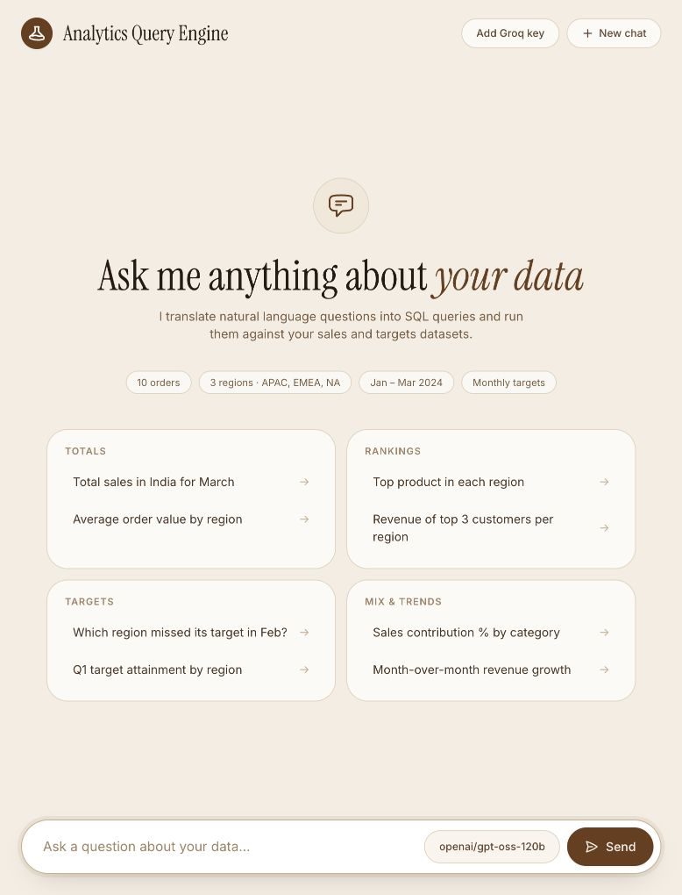
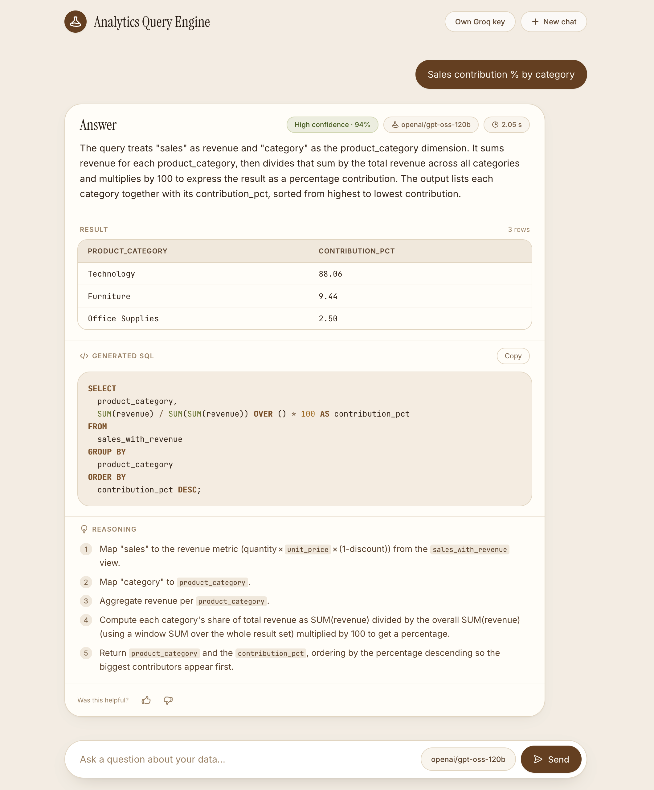

# Intelligent Analytics Query Engine

Ask questions about the included sales data in plain language. Groq turns them into DuckDB SQL, the app runs it locally, and the browser shows the result, SQL, explanation, and a confidence estimate.

Includes data preparation, a read-only SQL guard, a bounded response cache, user feedback, regression tests, and model evaluation traces.

<p align="center">
  
  
</p>

## Contents

- [Run locally](#run-locally)
- [How it works](#how-it-works)
- [Models and configuration](#models-and-configuration)
- [Caching](#caching)
- [Tests and evaluation](#tests-and-evaluation)
- [Evaluation results](#evaluation-results)
- [Limits and next improvements](#limits-and-next-improvements)
- [Project layout](#project-layout)

## Run locally

Requirements: Python 3.10+, [`uv`](https://docs.astral.sh/uv/), and a Groq API key with access to one of the supported models.

```bash
uv sync
```

Add your Groq key via **Add Groq key** at the top of the chat, or set a server key in `.env` (see `.env.example`):

```dotenv
GROQ_API_KEY_2=your_groq_api_key
```

Then start the app:

```bash
uv run python main.py
```

Open [http://localhost:8000](http://localhost:8000). Missing files under `data/processed/` are generated from the tracked source data on first query (or manually via `uv run python scripts/preprocess.py`). Paths are resolved from the repository root, so the checkout can live anywhere.

### API routes

| Method | Route | Purpose |
|---|---|---|
| `GET` | `/` | Chat interface |
| `POST` | `/api/query` | Generate and run a read-only query |
| `GET` | `/api/models` | List supported models and default |
| `GET` | `/api/history` | Read recent query history |
| `POST` | `/api/feedback` | Save thumbs feedback for a query |

```bash
curl -s http://localhost:8000/api/query \
  -H 'Content-Type: application/json' \
  -d '{"query":"Total sales in India for March"}'
```

This uses the server key in `.env`. API clients can instead pass `"api_key":"your_groq_api_key"` in the request body.

## How it works


**Data prep.** Raw files live in `data/`. `scripts/preprocess.py` cleans spreadsheet export issues and writes to the ignored `data/processed/` directory, regenerated automatically if missing. DuckDB loads sales and targets into memory and adds a `sales_with_revenue` view with `revenue = quantity * unit_price * (1 - discount)` and a `YYYY-MM` `order_month`. The prompt's data profile reads live from DuckDB (date coverage, valid category/geography values), and a hash of the loaded files identifies the data snapshot for caching.

**Query path.**
1. The browser sends a question, selected model, and optional user key to `/api/query`.
2. The engine builds a prompt from rules, schema, the live data profile, curated examples, and aggregate feedback counts.
3. A cache hit returns a previous successful answer without calling Groq or rerunning SQL.
4. On a miss, the server uses the supplied key (or its own configured key) to call Groq, which returns structured JSON with logic, SQL, explanation, and confidence.
5. DuckDB permits exactly one `SELECT`; external file and network access are disabled after data loading.
6. SQL or parsing errors trigger up to three generation attempts; rate-limit errors stop retries immediately.
7. Successful answers are returned, logged, and cached if within the size limit. Thumbs feedback updates the matching history row, and future prompts only see aggregate counts.

The model writes its explanation before seeing result rows. An [editable Excalidraw diagram](docs/diagrams/application-data-flow.excalidraw) and [clipboard JSON](docs/diagrams/application-data-flow.clipboard.json) cover the same flow.

**Prompt and safeguards.** `app/prompts.py` supplies the schema, metric definitions, dataset values, date coverage, DuckDB syntax guidance, examples, and rules for unavailable or ambiguous requests — including a requirement to explain assumptions and surface supporting metrics in rankings. Prompt instructions alone don't enforce safety: `app/database.py` rejects anything but a single `SELECT`, and DuckDB external access is disabled after source files load. Confidence is model-reported, not a calibrated probability.

## Models and configuration

Selectable models:

- `openai/gpt-oss-120b` (default)
- `openai/gpt-oss-20b`
- `qwen/qwen3.8-27b`

`GROQ_MODEL` sets the server default; the selected model is validated against the supported list. Other settings live in `app/config.py`:

| Setting | Default | Purpose |
|---|---:|---|
| `GROQ_TEMPERATURE` | `0.1` | Generation temperature |
| `GROQ_MAX_TOKENS` | `2048` | Maximum response tokens |
| `MAX_SELF_CORRECT_ATTEMPTS` | `3` | Generation and execution attempts |
| `QUERY_CACHE_MAX_ENTRIES` | `128` | Cache entry limit |
| `QUERY_CACHE_MAX_ENTRY_BYTES` | `262144` | Maximum response size per entry |

The key entered in the UI is saved in the tab's session storage, so it survives reloads and **New chat**; click **Done** to close the panel or **Clear** to remove the key. It's sent to the server with each query for Groq inference, and never saved in feedback history or the response cache. Invalid keys or keys without model access return an error rather than falling back to the server key.

## Caching

`app/cache.py` is a bounded, process-local LRU cache of successful responses. The key combines:

1. The question, whitespace collapsed (case and punctuation still matter).
2. The complete prompt, including feedback counts.
3. A hash of the loaded sales and target data.
4. Model, temperature, token limit, and a one-way fingerprint of the credential used.

So `"Total sales"` and `" Total   sales "` can share an entry, while a paraphrase misses and calls Groq again — the cache doesn't infer semantic similarity.

It holds up to 128 entries of at most 256 KiB each, evicting least-recently-used when full. Failed responses aren't cached. A cache hit returns a copy with `attempts=0` and `cache_hit=true`, and is still logged to history. Restarting the app clears the cache, and each server worker has its own. Changing the prompt, data, feedback context, model settings, or key causes a miss. Keys themselves are never stored in cache entries.

## Tests and evaluation

**Regression suite:**

```bash
uv run python -m unittest discover -s tests -p 'test_*.py' -v
```

Covers read-only enforcement, multiple statements, external file reads, scalar result comparison, feedback prompt-injection protection, rate-limit retries, and cache behavior.

**Model evaluation.** `tests/eval/queries.yaml` holds tiered questions — some with oracle SQL for exact comparison, others covering unsupported metrics, missing periods, prompt injection, and write requests.

Full harness (calls the local API, compares against DuckDB oracle queries, and uses Gemini to judge explanations and SQL quality — needs `GEMINI_API_KEY_0`–`GEMINI_API_KEY_3`; traces land in `tests/eval/traces/`):

```bash
uv run python main.py
uv run python -m tests.eval.run_eval
```

Groq-only runner if Gemini quota is unavailable (scores oracle cases locally; behavior cases need manual review):

```bash
uv run python -m tests.eval.run_groq_eval
uv run python -m tests.eval.run_groq_eval --ids T1.1 T3.1 T4.2
```

The evaluator normalizes numeric scalar strings and compares row/value pairs. Tier 4 behavior scores aren't measured correctness unless judged or manually reviewed.

## Evaluation results

Full results and traces are in [EVALUATION_TRACE.md](docs/EVALUATION_TRACE.md). Summary:

| Stage | Questions | Recorded result |
|---|---:|---|
| R0 baseline | 8 | Mean 66/100; 2 scored ≥80 |
| Early R1 | 27 | Mean 55.8/100; 6 scored ≥80; stopped after a generated `DELETE` affected later queries |
| Revised prompt and guards | 30 | All executed; 15/17 oracle shapes matched; 11/13 behavior cases passed manual review |

R0 and early R1 used different catalogs. On the same eight questions, recorded mean score rose from 66.0 to 82.1 under the early scoring rules — not a controlled estimate of a prompt change, since traces lacked full prompt snapshots and both code and evaluator behavior changed too.


*Each question ran once. See the [R0 trace](tests/eval/traces/2026-09-23T09-40_R0/results.jsonl) and [early R1 trace](tests/eval/traces/2026-09-23T09-47_R1/results.jsonl).*

On the 17 oracle questions shared by early R1 and the complete run, exact matches rose from 10/17 to 15/17 under the corrected comparator. One answer added useful target columns; another omitted raw revenue despite returning shares. T2.4's regions were correct but its output shape differed.


*The chart applies one comparator to saved outputs; it can't isolate the effect of individual changes.*

**What changed.** Early traces surfaced missing quarter filters, inconsistent percentage scales, an undefined target-gap sign, fabricated YoY/churn calculations, a successful `DELETE`, and incorrect relative-date interpretation. The evaluator also penalized correct scalar answers by comparing strings with numbers.

Fixes: the prompt gained a live data profile, metric/quarter definitions, DuckDB syntax notes, output-shape rules, missing-data behavior, confidence guidance, and worked examples. Code added the single-`SELECT` guard, disabled DuckDB external access, excluded raw feedback text from future prompts, stopped retries on rate limits, and added the bounded response cache. The evaluator fixed numeric scalar and row-aware comparisons.

| Issue | Later observation |
|---|---|
| Target comparisons omitted zero-sales regions | `targets LEFT JOIN` pattern returned the correct regions |
| Quarter, percentage, and gap errors | T3.2, T3.5, T3.8 matched oracle shapes |
| Invented YoY and churn answers | T4.1, T4.5 passed manual review |
| Generated `DELETE` changed data | T4.6 no longer deleted data |
| Scalar answers scored incorrectly | All four Tier 1 cases matched after evaluator fix |
| "Last month" used the wrong month | T4.2 still failed: February chosen at 93% confidence though March was the latest data |
| City comparison used the wrong target denominator | T4.11 picked the right city but an incomplete denominator |


**Complete Groq run.** 30 questions on `openai/gpt-oss-120b` (17 oracle, 13 behavior). Gemini judging was unavailable (quota), so behavior cases were reviewed manually; the first Groq key hit its daily limit after 21 questions, and the rest used a second key.

- All 30 questions executed on the first attempt.
- 15/17 oracle results matched the expected shape.
- 11/13 behavior cases passed manual review.
- Median latency ~39.8s, p90 ~44.3s.
- Prompt was ~20,039 characters.


*See the [per-case review](tests/eval/traces/2026-09-23T10-30_groq/combined_review.md) and [full trace](tests/eval/traces/2026-09-23T10-30_groq/results.complete.jsonl).*

This is single-run evidence on a 10-order dataset. Behavior cases were manually reviewed, not scored by a working Gemini judge.

**Recorded application check.** An earlier smoke test returned HTTP 200 for the UI, `6134.4` for total sales, reused the answer for a whitespace-only repeat, called the model for a paraphrase, accepted feedback, and rejected an empty query with HTTP 422. The 12-test regression suite passed at that time.

## Limits and next improvements

- Repeat evaluations with a working judge, multiple runs per question, and a larger dataset.
- Reduce prompt size, measure latency, and compare all three supported models.
- Clarify ambiguous time phrases like "last month" instead of silently choosing a meaning.
- Ask before comparing city/product results against regional targets, which don't exist at finer grain.
- Make defaults like "top 5" explicit, and clarify metrics where "best" could mean several things.
- Calibrate model-reported confidence using repeated evaluations.
- Use a shared cache across multiple processes; consider semantic matching, with safeguards for filters and dates.
- Move synchronous model/database work off the async request path before supporting sustained concurrency.

## Project layout

```text
.
├── main.py
├── app/                 # API, prompt, model client, DuckDB, cache, feedback
├── data/                # Tracked source data; processed files are generated
├── docs/
│   ├── charts/          # Evaluation charts
│   ├── diagrams/        # Data-flow PNG and editable Excalidraw files
│   └── EVALUATION_TRACE.md
├── scripts/             # Preprocessing and chart generation
└── tests/
    ├── test_regressions.py
    └── eval/             # Catalog, runners, and saved traces
```
